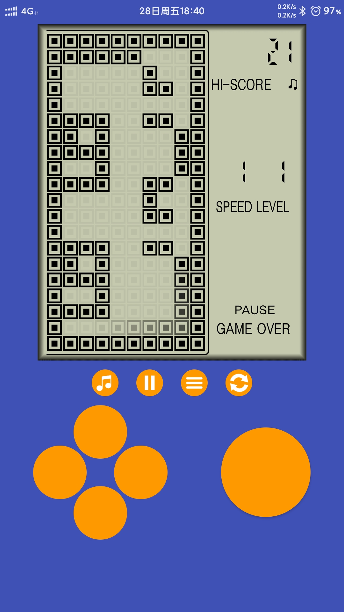
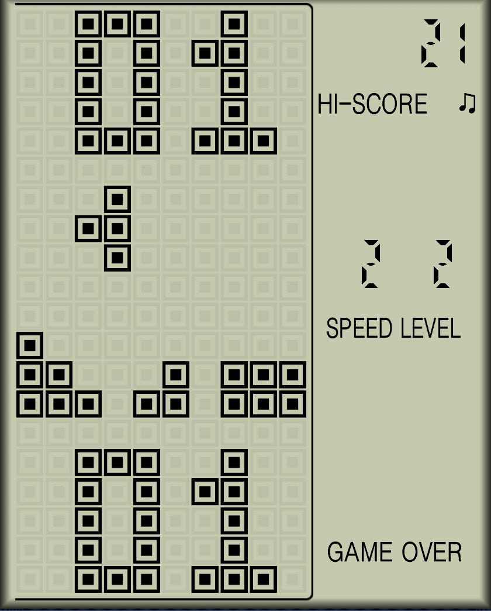
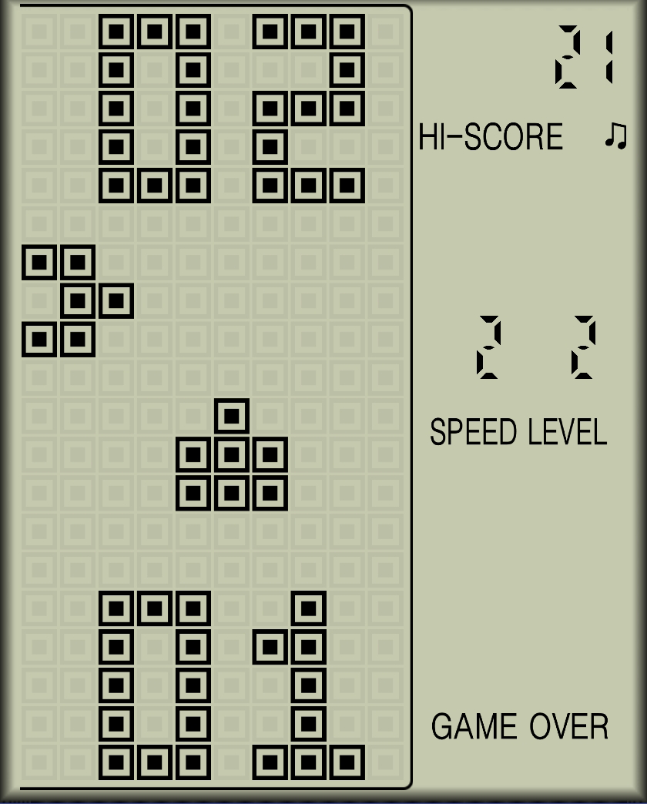
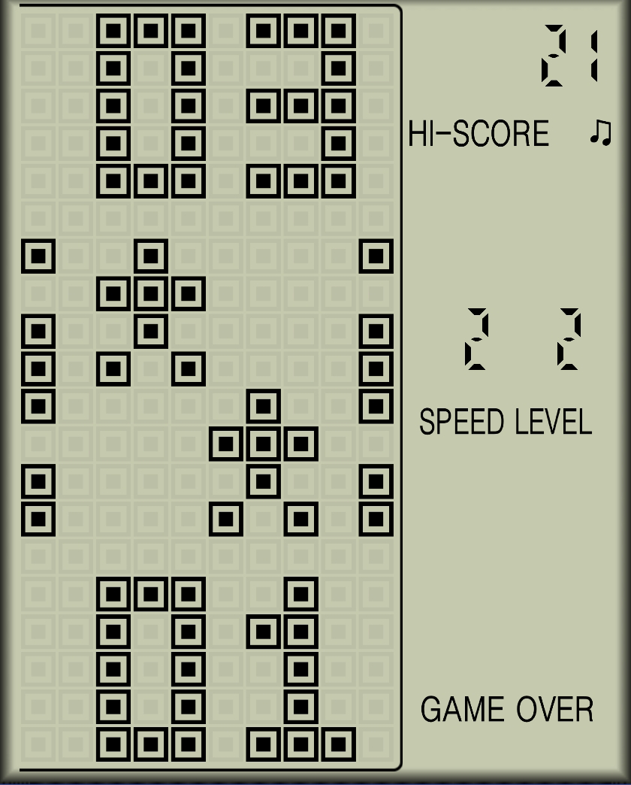
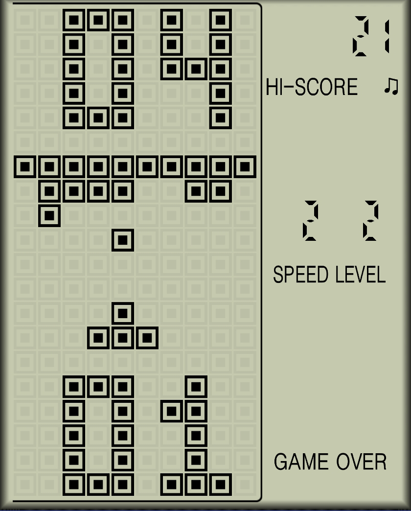
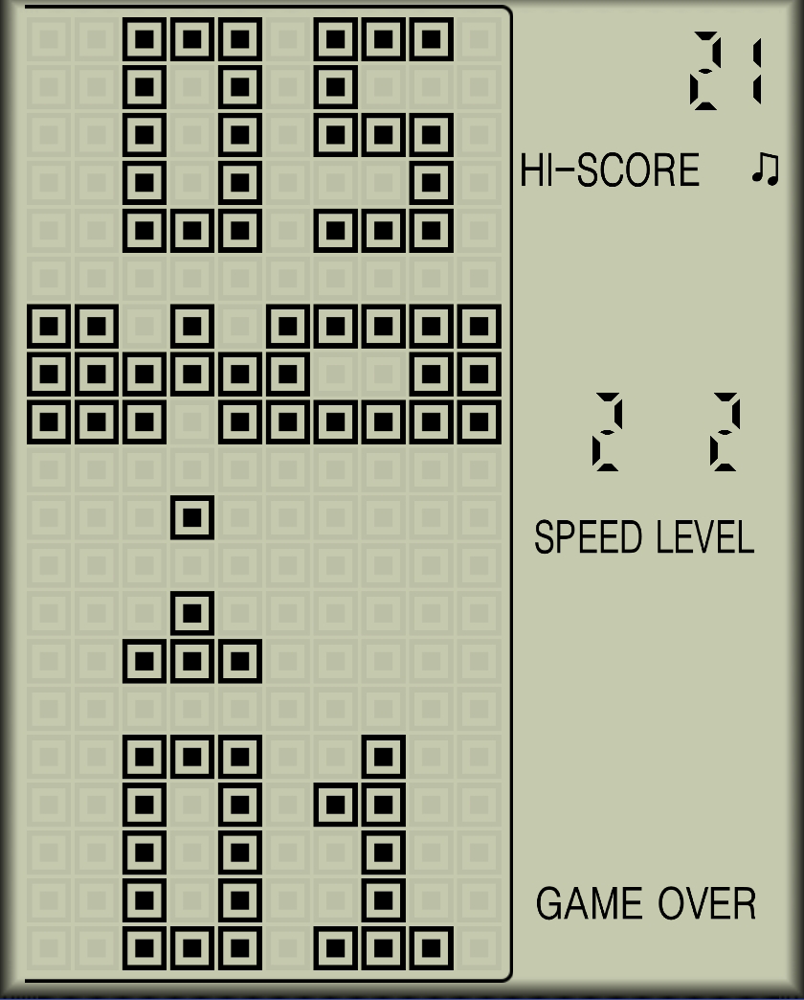
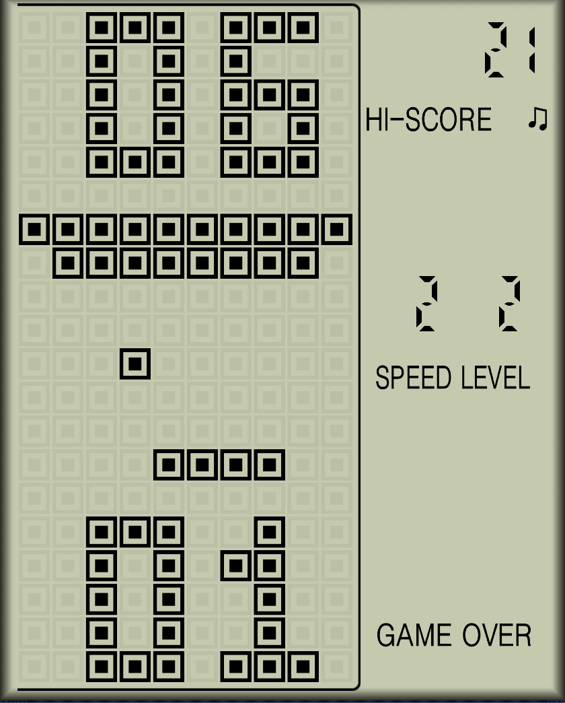
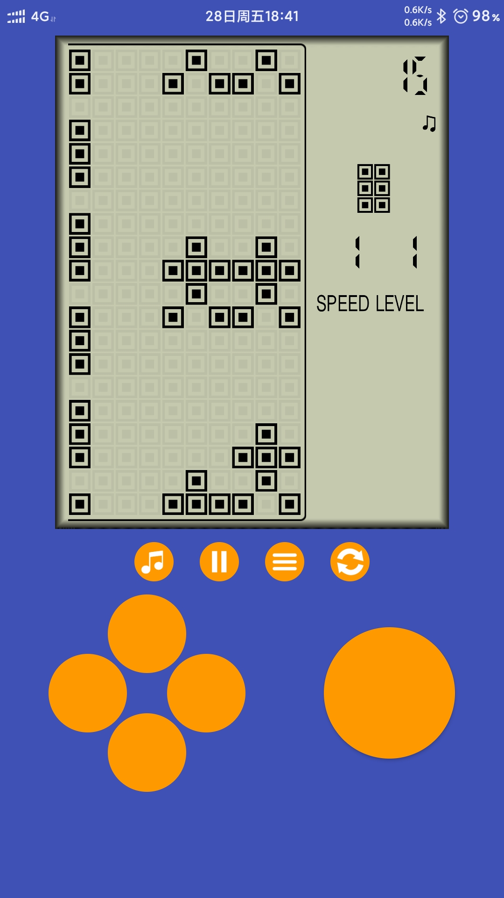
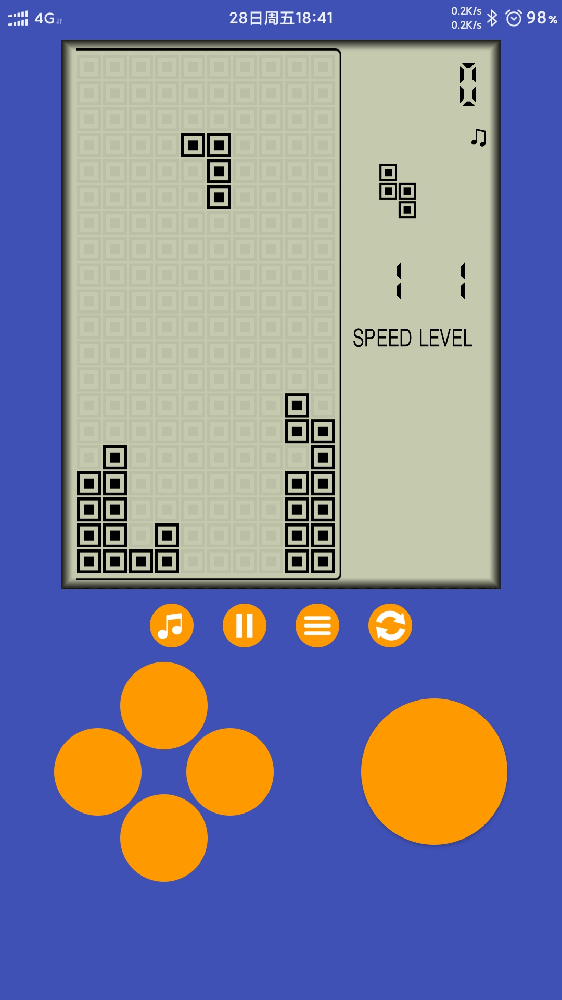

# 砖块游戏模拟器

大二时制作的砖块游戏模拟器，制作了6个游戏, 见下面的图片

#### 启动画面

#### 6个游戏

|  |  |  |
| ---------------------------------------------------- | ---------------------------------------------------- | ---------------------------------------------------- |
|  |  |  |

#### 内部

